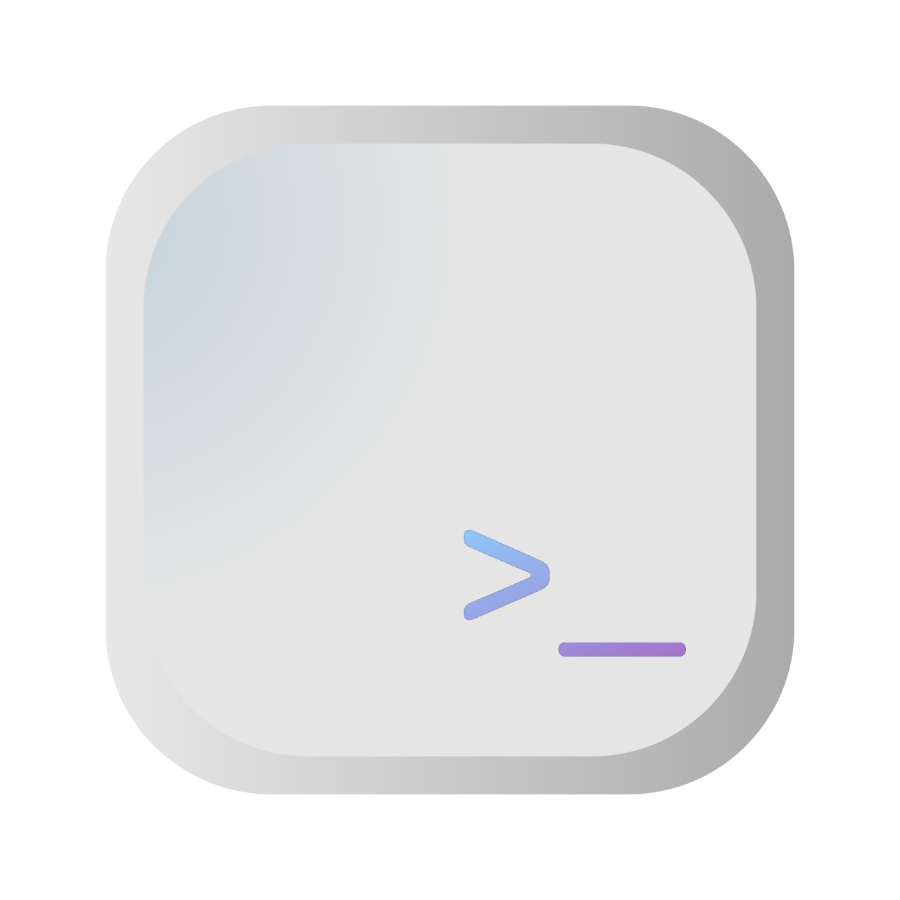

<p align="center">
<a href="./src/assets/icon.svg">

</a>
<h3 align="center">Lumina Terminal</h3>
</p>
<p align="center">
<a href="./README_zh.md">简体中文</a> | English
</p>

## Development
1. Clone the repo and enter it.
```shell
git clone https://github.com/iewnfod/lumina-terminal.git
cd lumina-terminal
```
2. Install dependencies.
```shell
pnpm install
```
3. Run tauri dev.
```shell
pnpm tauri dev
```

## Technology Used
* [Tauri](https://tauri.app/)
* [Rust](https://rust-lang.org/)
* [pnpm](https://pnpm.io/)
* [TypeScript](https://www.typescriptlang.org/)
* [React](https://react.dev/)
* [Vite](https://vite.dev/)
* [HeroUI](https://heroui.com/)
* [portable-pty](https://docs.rs/portable-pty/latest/portable_pty/)
* [Xterm.js](https://xtermjs.org/)
* [Tailwind CSS](https://tailwindcss.com/)

## License
[Mozilla Public License Version 2.0](./LICENSE)
