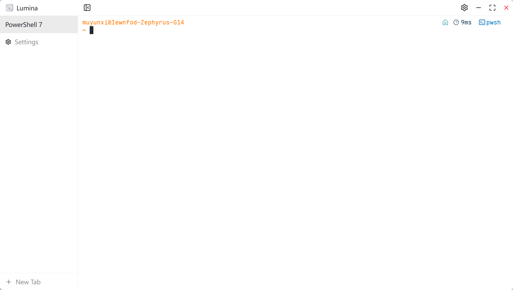
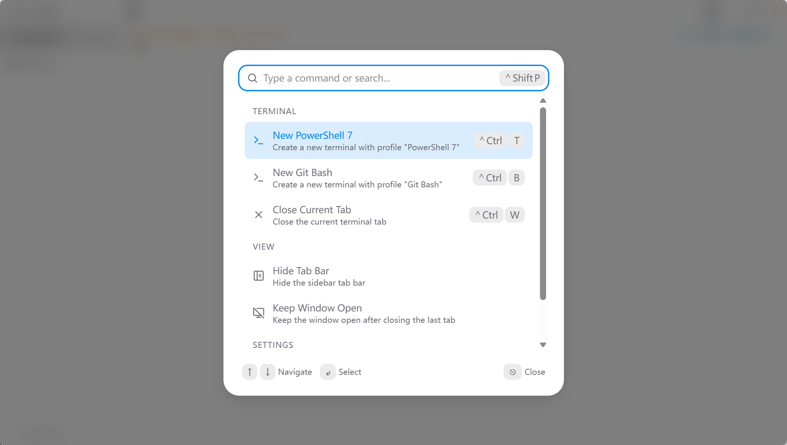
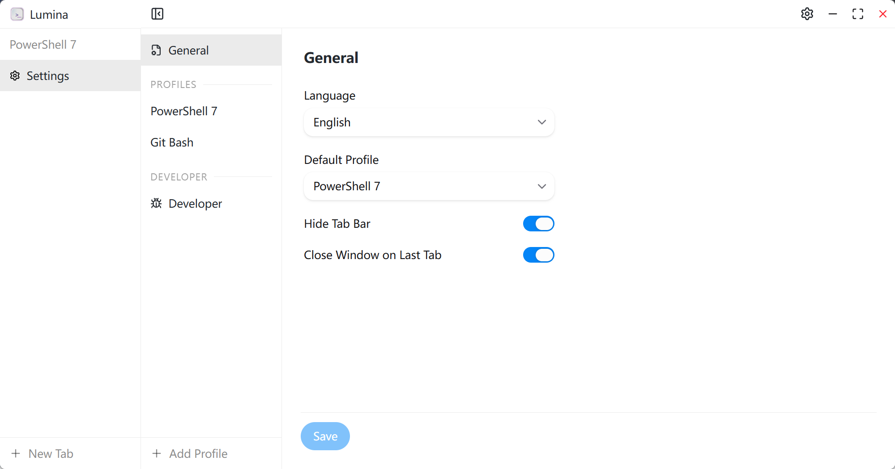
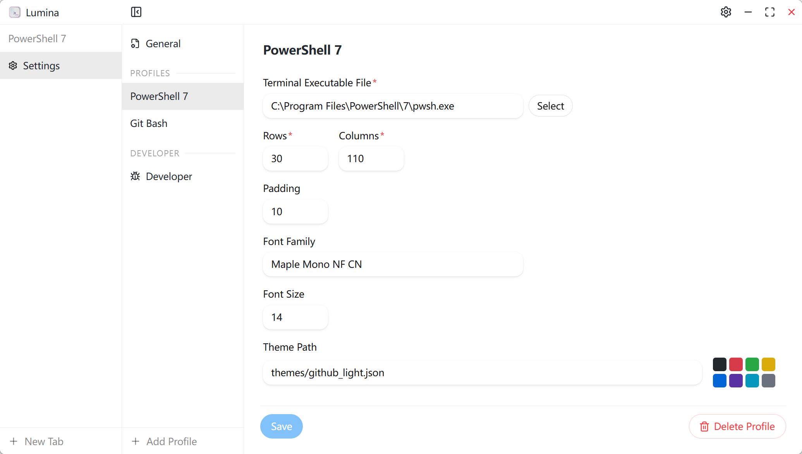

<p align="center">
  <a href="./src/assets/icon.svg">
    
  </a>
  <h3 align="center">Lumina Terminal</h3>
</p>
<p align="center">
  <a href="./README_zh.md">简体中文</a> | English
</p>

A modern, cross-platform terminal emulator built with Tauri, React, and Xterm.js — featuring a sleek UI, command palette, and customizable profiles.

## Screenshots

### Terminal
<p align="center">
  
</p>

### Command Palette
<p align="center">
  
</p>

### Settings
<p align="center">
  
</p>

### Profile
<p align="center">
  
</p>

## Performance

Lumina Terminal's rendering performance is close to [Alacritty](https://alacritty.org/), delivering smooth output even with large text files.

**Benchmark setup:**
```shell
# Generate test file
base64 /dev/urandom | head -c 50000000 > bigfile.txt
# Measure output time
time cat bigfile.txt
```

**Environment:** Windows 11 + WSL2 (Debian) via PowerShell 7

<p align="center">
  
</p>

Lumina Terminal completed in **0m4.008s** vs Alacritty's **0m3.223s** — well within the range for high-performance daily use.

## Development
1. Clone the repo and enter it.
```shell
git clone https://github.com/iewnfod/lumina-terminal.git
cd lumina-terminal
```
2. Install dependencies.
```shell
pnpm install
```
3. Run tauri dev.
```shell
pnpm tauri dev
```

## Technology Used
* [Tauri & Tauri Plugins](https://tauri.app/)
* [Rust](https://rust-lang.org/)
* [pnpm](https://pnpm.io/)
* [TypeScript](https://www.typescriptlang.org/)
* [React](https://react.dev/)
* [Vite](https://vite.dev/)
* [HeroUI](https://heroui.com/)
* [portable-pty](https://docs.rs/portable-pty/latest/portable_pty/)
* [Xterm.js](https://xtermjs.org/)
* [Tailwind CSS](https://tailwindcss.com/)
* [Lucide Icons](https://lucide.dev/)
* [log](https://docs.rs/log/latest/log/)

## License
[Mozilla Public License Version 2.0](./LICENSE)
