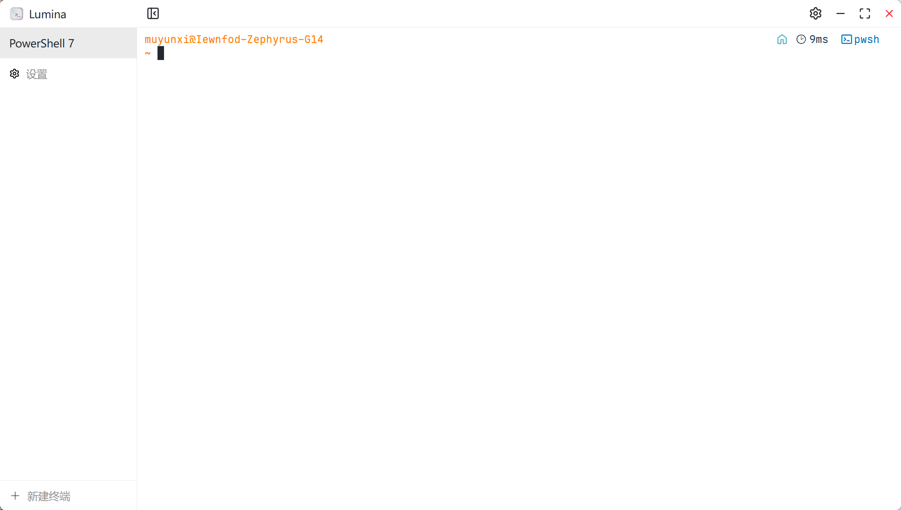
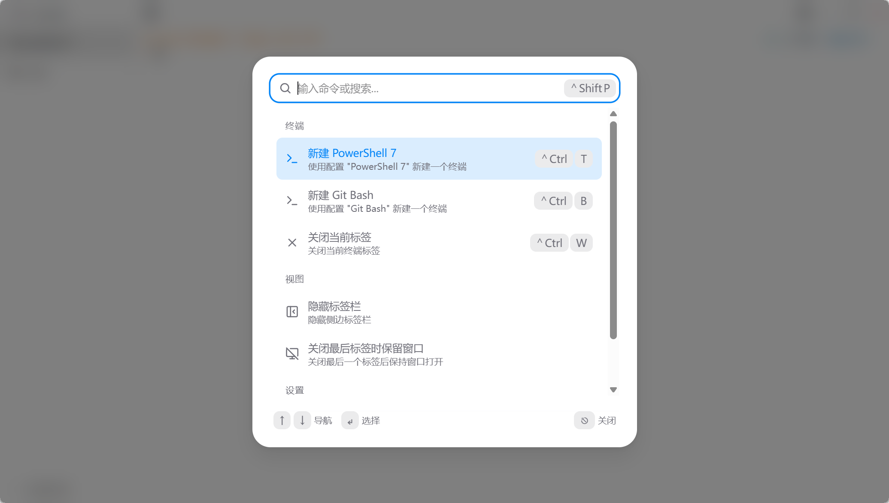
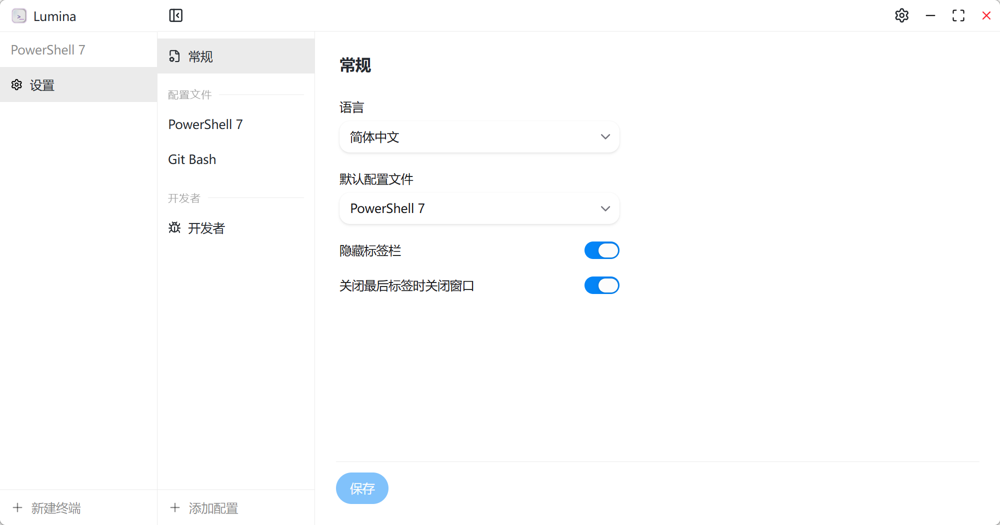
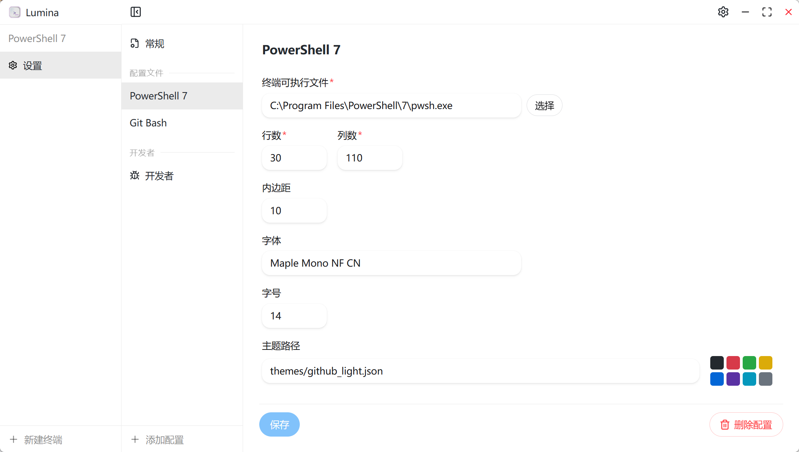
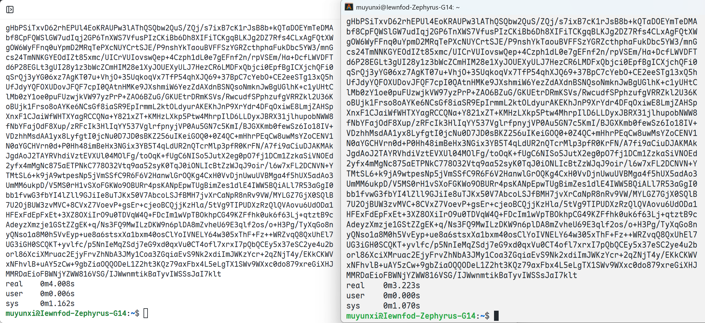

<p align="center">
  <a href="./src/assets/icon.svg">
    
  </a>
  <h3 align="center">Lumina Terminal</h3>
</p>
<p align="center">
  简体中文 | <a href="./README.md">English</a>
</p>

一个基于 Tauri、React 和 Xterm.js 构建的现代跨平台终端模拟器，拥有精美的界面、命令面板和可自定义的配置文件。

## 截图

### 终端
<p align="center">
  
</p>

### 命令面板
<p align="center">
  
</p>

### 设置
<p align="center">
  
</p>

### 配置文件
<p align="center">
  
</p>

## 功能特性

### 终端
* 基于 [portable-pty](https://docs.rs/portable-pty/latest/portable_pty/) 的多标签页终端 — 每个标签页运行一个真实的 Shell 进程
* 每个配置文件可指定不同的 Shell — 支持 PowerShell、WSL、Git Bash 等任意可执行文件
* [WebGL 渲染器](https://github.com/xtermjs/xterm.js/tree/master/addons/addon-webgl) — GPU 加速渲染（每个配置文件可独立开关）
* 分块批量输出 — 流畅处理大文本输出，不阻塞 UI
* 拖放文件到终端即可插入文件路径
* 窗口或容器大小变化时自动调整终端尺寸

### 用户界面
* **命令面板** (`Ctrl+Shift+P` / `Cmd+Shift+P`) — 搜索并执行命令，支持键盘导航
* **标签栏** — 侧边栏显示标签列表，支持拖拽区域和悬停关闭按钮，可通过标题栏或命令面板切换显示
* **自定义标题栏** — Windows 和 Linux 上窗口控制按钮与终端主题颜色融为一体
* **自动主题** — UI 明暗模式自动跟随终端背景色

### 键盘快捷键
* 完全可自定义的快捷键配置，保存在配置文件中
* 默认快捷键：
  * `Ctrl/Cmd+T` — 新建标签页
  * `Ctrl/Cmd+W` — 关闭当前标签页
  * `Ctrl/Cmd+,` — 打开设置
  * `Ctrl/Cmd+Shift+P` — 命令面板
  * `Ctrl/Cmd+1–9` — 按序号切换标签页
* `Ctrl+C` / `Ctrl+Shift+C` 互换（非 macOS）— `Ctrl+C` 复制选区，`Ctrl+Shift+C` 发送中断信号

### 配置文件
* 多个命名配置文件，各自独立设置 Shell、尺寸、字体和主题
* 每个配置文件可设置：
  * Shell 可执行文件路径（支持文件浏览器选择）
  * 行数与列数
  * 内边距
  * 字体族、粗细、大小和斜体样式
  * WebGL 渲染器开关
* 自定义终端主题，通过 JSON 文件加载（xterm.js ITheme 格式），支持实时颜色预览

### 国际化
* 英语 & 简体中文

### 欢迎向导
* 首次启动引导流程：语言选择 → 创建配置文件 → 撒花完成

## 性能

Lumina Terminal 的渲染性能已接近 [Alacritty](https://alacritty.org/)，在处理大文本文件时也能保持流畅输出。

**测试方案：**
```shell
# 生成测试文件
base64 /dev/urandom | head -c 50000000 > bigfile.txt
# 测量输出耗时
time cat bigfile.txt
```

**测试环境：** Windows 11 + WSL2 (Debian)，通过 PowerShell 7 运行

<p align="center">
  
</p>

Lumina Terminal 耗时 **0m4.008s**，Alacritty 耗时 **0m3.223s** — 性能已完全达到日常高频使用的标准。

## 开发
1. 克隆此仓库并进入目录
```shell
git clone https://github.com/iewnfod/lumina-terminal.git
cd lumina-terminal
```
2. 安装依赖
```shell
pnpm install
```
3. 运行 tauri dev
```shell
pnpm tauri dev
```

## 使用的技术
* [Tauri & Tauri Plugins](https://tauri.app/)
* [Rust](https://rust-lang.org/)
* [pnpm](https://pnpm.io/)
* [TypeScript](https://www.typescriptlang.org/)
* [React](https://zh-hans.react.dev/)
* [Vite](https://cn.vite.dev/)
* [HeroUI](https://heroui.com/)
* [portable-pty](https://docs.rs/portable-pty/latest/portable_pty/)
* [Xterm.js & Addons](https://xtermjs.org/)
* [Tailwind CSS](https://tailwindcss.com/)
* [Lucide Icons](https://lucide.dev/)
* [log](https://docs.rs/log/latest/log/)

## 开源协议
[Mozilla Public License Version 2.0](./LICENSE)
